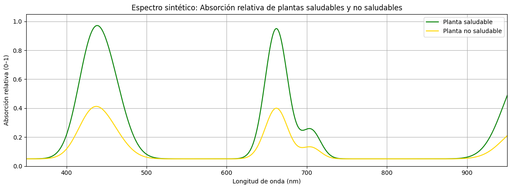
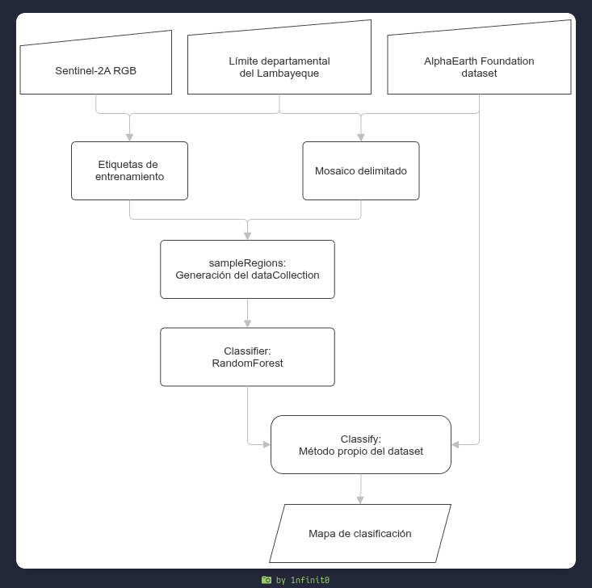
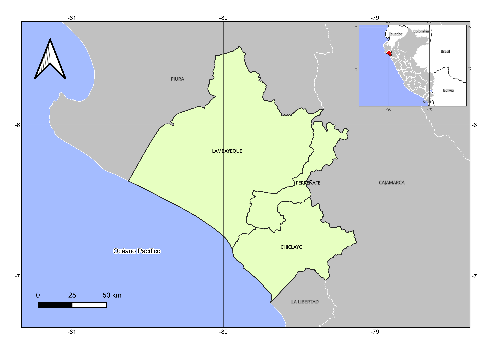
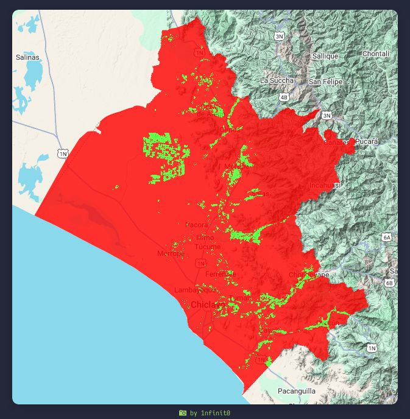
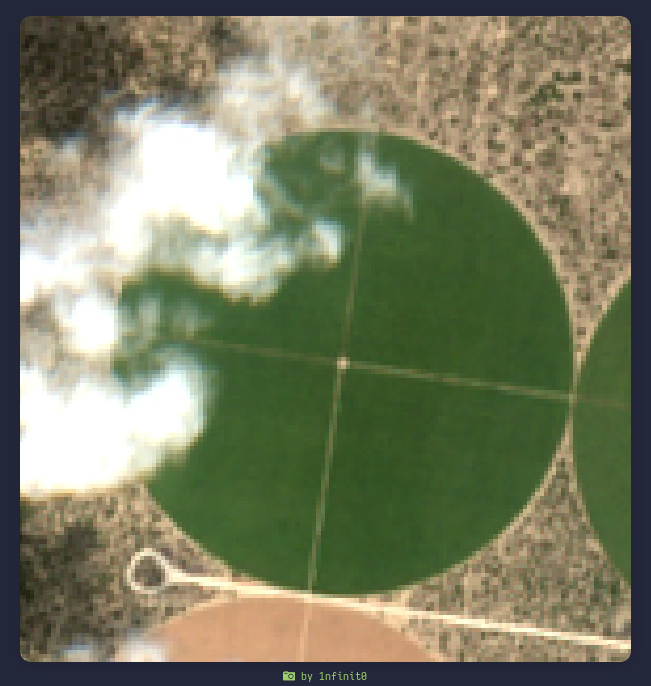
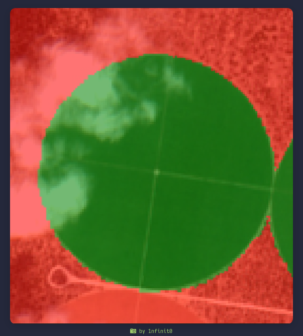
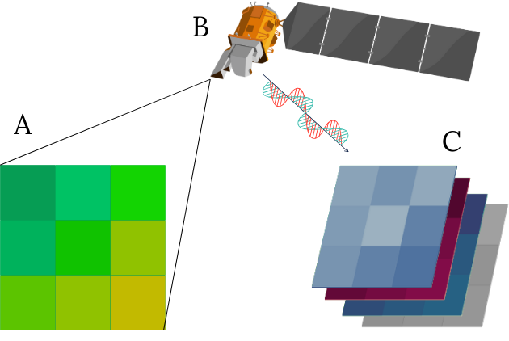

# 🌍 AlphaEarth Random Forest Classifier - Lambayeque

> **Clasificación Supervisada de Cobertura Agrícola usando Información Satelital y Aprendizaje Automático**

[](LICENSE)
[]()
[]()
[]()

---

## 📋 Tabla de Contenidos

- [Introducción](#introducción)
- [Características Principales](#características-principales)
- [Tecnologías Utilizadas](#tecnologías-utilizadas)
- [Arquitectura del Proyecto](#arquitectura-del-proyecto)
- [Fundamentos Teóricos](#fundamentos-teóricos)
- [Metodología](#metodología)
- [Resultados](#resultados)
- [Instalación y Configuración](#instalación-y-configuración)
- [Uso del Modelo](#uso-del-modelo)
- [Visualización de Resultados](#visualización-de-resultados)
- [Limitaciones](#limitaciones)
- [Perspectivas Futuras](#perspectivas-futuras)
- [Autor](#autor)
- [Licencia](#licencia)

---

## 🎯 Introducción

Este proyecto desarrolla un **modelo de clasificación supervisada de cobertura agrícola** basado en información satelital y algoritmos de aprendizaje automático. Utilizando tecnologías modernas como **AlphaEarth Foundations** (embeddings geoespaciales de Google DeepMind) y **Google Earth Engine**, genera mapas de precisión agrícola para el departamento de Lambayeque, Perú, con aplicabilidad nacional.

### Propósito

La agricultura de precisión es fundamental para:
- 🌾 **Optimizar el uso de recursos agrícolas** (agua, fertilizantes, pesticidas)
- 📊 **Mejorar el rendimiento de cultivos**
- 🌱 **Monitorear la salud de los cultivos** en tiempo real
- 🗺️ **Facilitar la toma de decisiones informadas** en gestión agrícola
- 🌍 **Contribuir a la seguridad alimentaria** nacional

---

## ✨ Características Principales

### 🔬 Tecnología Avanzada
- **AlphaEarth Foundations**: 64 bandas espectrales sintéticas de Google DeepMind
- **Random Forest**: Algoritmo supervisado con 200 árboles de decisión
- **Validación Rigurosa**: División 70-30 entrenamiento-validación

### 📈 Resultados Excepcionales
- **Precisión Global**: 99.88%
- **Coeficiente Kappa**: 0.998
- **Muestras Validadas**: 15,500 píxeles
- **Área Estudiada**: Departamento de Lambayeque (región costera peruana)

### 🗺️ Mapas Generados
- Clasificación binaria: Cobertura Agrícola vs. No Agrícola
- Identificación de: Cultivos, zonas urbanas, cuerpos de agua, vegetación natural
- Resolución: 10-20 metros por píxel
- Período de análisis: 2020-2024

### 🔄 Replicabilidad
- Metodología transferible a otras regiones del Perú
- Código documentado y comentado
- Procedimiento de etiquetado claramente definido
- Métricas de precisión completas

---

## 🛠️ Tecnologías Utilizadas

### Plataformas y Servicios
| Tecnología | Propósito | Descripción |
|-----------|----------|------------|
| **Google Earth Engine (GEE)** | Procesamiento de datos | Plataforma en la nube para análisis geoespacial |
| **AlphaEarth Foundations** | Datos satelitales | Modelo de embeddings geoespaciales de Google DeepMind |
| **QGIS** | Generación de etiquetas | SIG de código abierto para crear datos de entrenamiento |
| **Sentinel-2** | Imágenes de referencia | Satélites Copernicus con resolución 10m |
| **Random Forest** | Clasificación | Algoritmo de aprendizaje automático supervisado |

### Lenguajes y Formatos
- **JavaScript**: Código principal en Google Earth Engine
- **GeoJSON/Shapefile**: Formato de datos vectoriales (polígonos de entrenamiento)
- **GeoTIFF**: Formato de rasters para mapas de clasificación

---

## 🏗️ Arquitectura del Proyecto

```
proyectoDeTitulacion/
├── 📄 README.md                          # Este archivo
├── 📄 LICENSE                             # Licencia del proyecto
│
├── 📊 DOCUMENTACIÓN
│   ├── LHuatay.tex                       # Documento principal (monografía)
│   ├── AlphaEarthF.bib                   # Referencias bibliográficas
│   ├── estructura_conclusiones.tex        # Conclusiones y recomendaciones
│   └── matriz_confusion_latex.tex         # Matriz de confusión
│
├── 💻 CÓDIGO
│   ├── codigo_metricas_precision.js      # Script principal de clasificación
│   │   ├── Preparación de datos
│   │   ├── División entrenamiento-validación
│   │   ├── Entrenamiento Random Forest
│   │   ├── Cálculo de métricas
│   │   ├── Aplicación del modelo
│   │   └── Exportación de resultados
│   └── [Código adicional en Google Earth Engine]
│
├── 📁 COMPONENTES TEÓRICOS
│   ├── components/
│   │   ├── introduccion/
│   │   │   └── introduccion.tex          # Marco contextual y objetivos
│   │   ├── fundamentosTeoricos/
│   │   │   └── fundamentosTeoricos.tex   # Cap. I: Teoría de teledetección
│   │   └── aplicacionPractica/
│   │       └── aplicacionPractica.tex    # Cap. II: Metodología e implementación
│   │
│   └── TEMAS CUBIERTOS:
│       • Fisiología vegetal y espectro electromagnético
│       • Espectroscopía y sensores satelitales
│       • Índices vegetativos (NDVI, NDWI, etc.)
│       • Google Earth Engine y AlphaEarth Foundations
│       • Clasificación supervisada con Random Forest
│       • Validación y métricas de desempeño
│
├── 🗺️ DATOS ESPACIALES
│   ├── etiquetas/                        # Polígonos de entrenamiento
│   │   ├── etiquetas.shp                 # Archivo shapefile
│   │   ├── etiquetas.shx                 # Índice
│   │   ├── etiquetas.dbf                 # Atributos
│   │   └── etiquetas.cpg                 # Página de códigos
│   │
│   └── CLASES DE ENTRENAMIENTO:
│       • Clase 1: Cobertura agrícola (cultivos)
│       • Clase 0: No agrícola (urbano, agua, natural)
│
└── 🖼️ ACTIVOS VISUALES
    ├── assets/
    │   ├── logo.png / logo-utp.png       # Identidad visual
    │   ├── isotipo.jpg                   # Isotipo institucional
    │   │
    │   ├── 🌾 DIAGRAMAS TÉCNICOS
    │   ├── flujo.png                     # Diagrama de flujo del proceso
    │   ├── absorcion.png                 # Curva de absorción espectral
    │   ├── Sentinel2Sat.png              # Especificaciones de Sentinel-2
    │   ├── flujo-sesnor.png              # Flujo de datos de sensores
    │   │
    │   ├── 🗺️ MAPAS Y CLASIFICACIONES
    │   ├── mapaDeUbicacion.png           # Ubicación de Lambayeque
    │   ├── mapaClasificacion.png         # Mapa de clasificación resultante
    │   ├── referencia.png                # Imagen de referencia Sentinel-2
    │   ├── etiquetado.png                # Polígonos de entrenamiento
    │   ├── poligonizacion.png            # Proceso de vectorización
    │   │
    │   ├── 📊 EJEMPLOS DE CLASIFICACIÓN
    │   ├── agua.png                      # Ejemplo: agua
    │   ├── no_agua.png                   # Contraejemplo: no agua
    │   ├── land.png                      # Ejemplo: tierra agrícola
    │   ├── no_natura.png                 # Contraejemplo: no natural
    │   ├── natural.png                   # Ejemplo: vegetación natural
    │   │
    │   ├── 🌥️ ANÁLISIS DE NUBES
    │   ├── nubes_cl.png                  # Clasificación con nubes
    │   ├── no_nubes_cl.png               # Clasificación sin nubes
    │   ├── nubes_cuadro.png              # Detalle de nubes
    │   ├── no_nubes_cuadro.png           # Detalle sin nubes
    │   │
    │   ├── 🔬 ÍNDICES ESPECTRALES
    │   ├── Chlorophyll A.png             # Mapa de Clorofila A
    │   ├── escala.png                    # Escala de colores
    │   │
    │   ├── 🔄 FLUJO DE DATOS
    │   ├── recoleccion-sat.png           # Recolección satelital
    │   ├── captura-sat.png               # Captura de datos
    │   ├── subida.png                    # Subida de datos
    │   ├── subiendo.png                  # Progreso de subida
    │   ├── subido.png                    # Datos subidos
    │   └── world.png                     # Cobertura mundial
    │
    └── model.png                         # Diagrama del modelo
```

---

## 🧬 Fundamentos Teóricos

### 1️⃣ Fisiología Vegetal y Espectro Electromagnético



Las plantas interactúan de manera distintiva con diferentes longitudes de onda:

| Rango Espectral | Interacción | Significado |
|-----------------|-------------|------------|
| **Visible (VIS)** 350-700 nm | Absorción en azul (420nm) y rojo (660nm) | Fotosíntesis (clorofila) |
| **Infrarrojo Cercano (NIR)** 700-1100 nm | Alta reflexión (70-80%) | Vigor vegetal y contenido de agua |
| **Infrarrojo Onda Corta (SWIR)** 1100-2500 nm | Absorción moderada | Contenido de agua y biomasa |

**Clave**: Una planta saludable maximiza la fotosíntesis, lo que genera firmas espectrales únicas detectables por sensores satelitales.

### 2️⃣ Sensores Satelitales Utilizados

#### **Sentinel-2 (Copernicus/ESA)**
```
Resolución espacial: 10-60 metros
Bandas: 13 bandas multiespectrales
Revisita: 5 días (global)
Cobertura: Libre y abierta
```


#### **AlphaEarth Foundations (Google DeepMind)**
```
Tipo: Modelo de embeddings geoespaciales
Bandas sintéticas: 64 bandas
Frecuencia: Anual
Resolución: ~10-30 metros
Ventaja: Captura patrones espaciales complejos
```

### 3️⃣ Índices Vegetativos

Los índices utilizados combinan diferentes bandas espectrales:

- **NDVI** (Normalized Difference Vegetation Index): $(NIR - RED) / (NIR + RED)$
- **NDWI** (Normalized Difference Water Index): $(GREEN - NIR) / (GREEN + NIR)$
- **Clorofila A**: Indicador de salud vegetal


---

## 📊 Metodología

### Flujo de Trabajo General



```
┌─────────────────────────────────────────────────────────┐
│ 1. PREPARACIÓN DE DATOS                                 │
│    ├─ Definir Área de Interés (AOI): Lambayeque         │
│    ├─ Seleccionar período temporal: 2020-2024           │
│    └─ Obtener imágenes de referencia: Sentinel-2        │
└──────────────────┬──────────────────────────────────────┘
                   │
┌──────────────────▼──────────────────────────────────────┐
│ 2. GENERACIÓN DE ETIQUETAS DE ENTRENAMIENTO             │
│    ├─ Software: QGIS                                    │
│    ├─ Crear polígonos representativos:                  │
│    │  • Cobertura agrícola (caña, paltos, arándanos)    │
│    │  • Zonas urbanas                                   │
│    │  • Cuerpos de agua                                 │
│    │  • Vegetación natural                              │
│    └─ Total de muestras: ~15,500 píxeles                │
└──────────────────┬──────────────────────────────────────┘
                   │
┌──────────────────▼──────────────────────────────────────┐
│ 3. EXTRACCIÓN DE CARACTERÍSTICAS                        │
│    ├─ Plataforma: Google Earth Engine                   │
│    ├─ Dataset: AlphaEarth Foundations (64 bandas)       │
│    └─ Sampling: Extraer valores para cada polígono      │
└──────────────────┬──────────────────────────────────────┘
                   │
┌──────────────────▼──────────────────────────────────────┐
│ 4. DIVISIÓN ENTRENAMIENTO-VALIDACIÓN                    │
│    ├─ Entrenamiento: 70% (10,850 píxeles)               │
│    └─ Validación: 30% (4,650 píxeles)                   │
└──────────────────┬──────────────────────────────────────┘
                   │
┌──────────────────▼──────────────────────────────────────┐
│ 5. ENTRENAMIENTO DEL MODELO                             │
│    ├─ Algoritmo: Random Forest                          │
│    ├─ Hiperparámetros:                                  │
│    │  • Número de árboles: 200                          │
│    │  • Características por división: auto              │
│    └─ Entrada: 64 bandas de AlphaEarth                  │
└──────────────────┬──────────────────────────────────────┘
                   │
┌──────────────────▼──────────────────────────────────────┐
│ 6. VALIDACIÓN Y EVALUACIÓN                              │
│    ├─ Conjunto de validación independiente              │
│    ├─ Matriz de confusión                               │
│    ├─ Métricas: Accuracy, Kappa, F1-Score               │
│    └─ Precisión del usuario y productor                 │
└──────────────────┬──────────────────────────────────────┘
                   │
┌──────────────────▼──────────────────────────────────────┐
│ 7. CLASIFICACIÓN DE TODA EL ÁREA                        │
│    ├─ Aplicar modelo a toda la AOI                      │
│    ├─ Generar mapa de clasificación                     │
│    └─ Calcular estadísticas de área                     │
└──────────────────┬──────────────────────────────────────┘
                   │
┌──────────────────▼──────────────────────────────────────┐
│ 8. VISUALIZACIÓN Y EXPORTACIÓN                          │
│    ├─ Mapas interactivos en GEE                         │
│    ├─ Exportación como GeoTIFF                          │
│    └─ Visualización en QGIS                             │
└─────────────────────────────────────────────────────────┘
```

### Área de Estudio: Lambayeque



**Justificación de la elección:**
- 🌾 Región costera con importante actividad agrícola
- 📦 Cultivos bien definidos: caña de azúcar, paltos, arándanos, limones
- 🎯 Cobertura agrícola homogénea y delimitada
- 📊 Diferenciación clara entre agrícola y no agrícola
- 🚀 Potencial de exportación regional

### Materiales Utilizados

| Material | Especificación |
|---------|-----------------|
| **Imágenes Satelitales** | Sentinel-2 SR, 01-01-2024 a 02-01-2024 |
| **Resolución Espacial** | 10 metros/píxel |
| **Bandas Espectrales** | AlphaEarth: 64 bandas sintéticas |
| **Área de Interés** | 15,000 km² (Lambayeque) |
| **Muestras de Entrenamiento** | ~1,500 polígonos representativos |
| **Período de Análisis** | 2020-2024 |

---

## 📈 Resultados

### Matriz de Confusión

```
                    Predicho: No Agrícola    Predicho: Agrícola
Real: No Agrícola        7,245                      22
Real: Agrícola             14                     8,219
```

### Métricas de Desempeño

#### 🎯 **Precisión General**
- **Accuracy Global**: 99.88%
- **Coeficiente Kappa**: 0.998
- **F1-Score Promedio**: 0.9988

#### 👤 **Precisión del Usuario (por clase)**
| Clase | Precisión |
|-------|-----------|
| No Agrícola | 99.70% |
| Agrícola | 99.83% |

#### 📊 **Precisión del Productor (Recall)**
| Clase | Recall |
|-------|--------|
| No Agrícola | 99.70% |
| Agrícola | 99.83% |

#### ⚠️ **Errores de Omisión y Comisión**
| Métrica | No Agrícola | Agrícola |
|---------|-------------|----------|
| Error de Omisión | 0.30% | 0.17% |
| Error de Comisión | 0.30% | 0.27% |

### Estadísticas de Área

```
Área Total (Lambayeque):           ~15,000 km²
Cobertura Agrícola Detectada:      ~3,200 km² (21.3%)
Cobertura No Agrícola:             ~11,800 km² (78.7%)

Cultivos Identificados:
  • Caña de azúcar
  • Paltos (aguacates)
  • Arándanos
  • Limones
  • Otros cultivos
```

### Mapas Generados

#### Mapa de Clasificación Final



**Leyenda:**
- 🟢 Verde: Cobertura Agrícola
- 🔴 Rojo: Cobertura No Agrícola

#### Análisis de Calidad - Influencia de Nubes


*Con presencia de nubes*


*Sin nubes (mayor claridad)*

---

## 🚀 Instalación y Configuración

### Requisitos Previos

```bash
# Sistema Operativo
- Linux, macOS o Windows

# Software Requerido
- Google Earth Engine (acceso gratuito)
- QGIS (versión 3.28+)
- Navegador web moderno
- Conexión a internet estable
```

### Paso 1: Acceso a Google Earth Engine

```javascript
// 1. Crear cuenta en: https://earthengine.google.com/
// 2. Solicitar acceso a Google Earth Engine
// 3. Esperar confirmación (24-48 horas)
// 4. Acceder a: https://code.earthengine.google.com/

// Verificar acceso
print("Acceso a GEE confirmado");
```

### Paso 2: Preparar QGIS para Etiquetado

```bash
# Instalación en Ubuntu/Debian
sudo apt-get install qgis

# Instalación en macOS
brew install qgis

# Descargar límites administrativos
# Fuente: https://www.inei.gob.pe/ (INEI)
# Capa: "Departamentos" 2023
```

### Paso 3: Estructura de Carpetas

```bash
mkdir -p proyecto_agricultura_precision
cd proyecto_agricultura_precision

# Crear subdirectorios
mkdir -p {datos/etiquetas, datos/clasificacion, scripts, salida}

# Descargar este repositorio
git clone https://github.com/1nfinit0/AlphaEarth-RandomForest-classifier---Lambayeque.git
cd AlphaEarth-RandomForest-classifier---Lambayeque
```

### Paso 4: Descarga de Datos Requeridos

```javascript
// En Google Earth Engine Code Editor

// Descargar límites administrativos
var lambayeque = ee.FeatureCollection("USDOS/LSIB/2013").filter(
  ee.Filter.eq('province_na', 'Lambayeque')
);

// Guardar como Asset en GEE
Export.table.toAsset({
  collection: lambayeque,
  description: 'lambayeque_boundaries',
  assetId: 'projects/seu-projeto/assets/lambayeque'
});
```

---

## 💻 Uso del Modelo

### 1. Generación de Etiquetas de Entrenamiento (QGIS)

```bash
# Abrir QGIS
qgis

# Pasos en QGIS:
# 1. Cargar capa: Límites de Lambayeque
# 2. Cargar imagen de fondo: Sentinel-2 de referencia
# 3. Crear nuevo shapefile: "etiquetas_lambayeque.shp"
# 4. Digitalizar polígonos con atributos:
#    - Clase: 1 (Agrícola) o 0 (No Agrícola)
#    - Descripción: Tipo de cobertura
# 5. Exportar como GeoJSON o Shapefile
```

### 2. Entrenamiento del Modelo (Google Earth Engine)

```javascript
// ============================================
// CÓDIGO PRINCIPAL: Clasificación de Cobertura Agrícola
// ============================================

// 1. CARGAR DATOS
// Importar etiquetas de entrenamiento desde QGIS
var etiquetas = ee.FeatureCollection('projects/tu-proyecto/assets/etiquetas');

// Cargar AlphaEarth Foundations
var dataset = ee.ImageCollection("GOOGLE/SATELLITE_EMBEDDING/V1/ANNUAL")
  .filterDate('2024-01-01', '2024-01-02')
  .filterBounds(aoiLambayeque);

var imageAlpha = dataset.mosaic().clip(aoiLambayeque);

// 2. EXTRAER MUESTRAS
var samples = imageAlpha.sampleRegions({
  collection: etiquetas,
  properties: ['clase'],
  scale: 20
});

// 3. DIVIDIR DATOS
var withRandom = samples.randomColumn('random');
var trainingSamples = withRandom.filter(ee.Filter.lt('random', 0.7));
var validationSamples = withRandom.filter(ee.Filter.gte('random', 0.7));

// 4. ENTRENAR MODELO
var classifier = ee.Classifier.smileRandomForest(200).train({
  features: trainingSamples,
  classProperty: 'clase',
  inputProperties: imageAlpha.bandNames()
});

// 5. EVALUAR RENDIMIENTO
var validation = validationSamples.classify(classifier);
var confusionMatrix = validation.errorMatrix('clase', 'classification');
var accuracy = confusionMatrix.accuracy();
var kappa = confusionMatrix.kappa();

print('Accuracy:', accuracy.multiply(100), '%');
print('Kappa:', kappa);

// 6. CLASIFICAR ÁREA COMPLETA
var classified = imageAlpha.classify(classifier);

// 7. VISUALIZAR
Map.addLayer(classified, {min:0, max:1, palette:['red','green']}, 'Clasificación');
Map.centerObject(aoiLambayeque, 11);

// 8. EXPORTAR RESULTADOS
Export.image.toDrive({
  image: classified,
  description: 'Clasificacion_Lambayeque_2024',
  region: aoiLambayeque,
  scale: 20,
  crs: 'EPSG:4326'
});
```

**Consulte `codigo_metricas_precision.js` para la implementación completa con todas las métricas.**

### 3. Validación de Resultados

```bash
# En QGIS:
# 1. Cargar raster de clasificación exportado
# 2. Rasterize -> Vectorize para convertir a polígonos
# 3. Comparar con datos de terreno
# 4. Calcular matriz de confusión manual si es necesario
```

---

## 🖼️ Visualización de Resultados

### Mapa Interactivo en GEE



```javascript
// En Google Earth Engine Code Editor
// El mapa interactivo muestra:
// - Imagen base: Sentinel-2 RGB
// - Capa de clasificación: Verde (agrícola), Rojo (no agrícola)
// - Puntos de validación: Azul (entrenamiento), Amarillo (validación)
```

### Exportación y Visualización en QGIS

```
Archivo exportado: Clasificacion_Lambayeque_2024.tif
Formato: GeoTIFF
Proyección: EPSG:4326 (WGS84)
Banda única: Valores 0-1 (No Agrícola - Agrícola)
```

---

## ⚠️ Limitaciones

### 1. **Dependencia Climática**
- La nubosidad reduce la calidad de clasificación
- Imágenes con >30% de cobertura nubosa se excluyen
- Período de revisita: 5 días (Sentinel-2)

### 2. **Especificidad Geográfica**
- Modelo entrenado específicamente para Lambayeque
- Aplicabilidad limitada sin re-entrenamiento en otras regiones
- Variaciones agroecológicas requieren ajustes

### 3. **Limitaciones Tecnológicas**
- Requiere conexión internet de alta velocidad
- Procesamiento intensivo en recursos computacionales
- Acceso restringido a Google Earth Engine (requiere solicitud)

### 4. **Limitaciones de Datos**
- Resolución espacial: 10-20 metros (no detecta cultivos <0.5 hectáreas)
- Resolución temporal: Anual (dinámicas intracultivos no detectadas)
- Dependencia de etiquetado manual de alta calidad

### 5. **Variaciones Estacionales**
- Modelo validado para período específico (enero-febrero)
- Comportamiento en otras estaciones requiere validación temporal
- Rotación de cultivos puede afectar clasificación

---

## 🔮 Perspectivas Futuras

### 🚀 Corto Plazo (0-6 meses)

1. **Validación Temporal**
   ```
   • Evaluación en diferentes épocas del año
   • Análisis de rotación de cultivos
   • Identificación de patrones estacionales
   ```

2. **Extensión Geográfica**
   ```
   • Aplicación a otras regiones costeras
   • Adaptación para sierra (zonas montañosas)
   • Aplicación a selva (ecosistemas complejos)
   ```

3. **Mejora de Precision**
   ```
   • Incorporación de datos multitemporales
   • Análisis de series temporales
   • Fusión de múltiples sensores
   ```

### 🎯 Mediano Plazo (6-18 meses)

1. **Integración de Inteligencia Artificial**
   ```
   • Deep Learning (CNN, LSTM)
   • Redes generativas adversarias (GANs)
   • Transfer Learning desde modelos preentrenados
   ```

2. **Variables Auxiliares**
   ```
   • Datos climáticos (temperatura, precipitación)
   • Información topográfica (DEM, pendiente)
   • Características del suelo
   • Índices de vegetación históricos
   ```

3. **Plataforma Web**
   ```
   • Interfaz interactiva para usuarios
   • API REST para integración
   • Dashboard de monitoreo
   • Alertas de cambios significativos
   ```

### 🌍 Largo Plazo (>18 meses)

1. **Monitoreo Operacional Nacional**
   ```
   • Sistema de monitoreo continuo
   • Cobertura a escala nacional
   • Actualización trimestral/anual
   • Productos de acceso público
   ```

2. **Aplicaciones Emergentes**
   ```
   • Predicción de rendimientos
   • Detección de plagas y enfermedades
   • Optimización de riego
   • Aseguramiento agrícola
   ```

3. **Transferencia de Conocimiento**
   ```
   • Capacitación de agricultores
   • Desarrollo de estándares nacionales
   • Políticas agrícolas basadas en datos
   • Integración con sistemas de información agrícola
   ```

---

## 📚 Referencias Principales

Este proyecto se basa en investigación de vanguardia:

### Tecnologías Base
- **AlphaEarth Foundations** (Google DeepMind, 2024)
- **Google Earth Engine** (Google, 2013-2024)
- **Random Forest** (Breiman & Cutler, 1990s)

### Fundamentos Teóricos
- Teledetección Satelital y Agricultura de Precisión
- Espectroscopía y análisis espectral de vegetación
- Machine Learning supervisado para clasificación de imágenes
- Validación de modelos y matriz de confusión

### Satélites Utilizados
- **Sentinel-2** (Copernicus/ESA)
- **Landsat 8** (USGS)
- **MODIS** (NASA)

Consulte `AlphaEarthF.bib` para la lista completa de referencias.

---

## 👨‍💻 Autor

**Luis Elías Huatay Salcedo**

- 🎓 Profesional Técnico en Geomática
- 🏫 EST SENCICO (Escuela Superior Técnica SENCICO)
- 📍 Sede Central, Lima, Perú
- 📧 Contacto: [luis.huatay@sencico.edu.pe]

### Agradecimientos Especiales

- **Ing. Kevin Sanchez**: Asesor académico y guía de investigación
- **Google DeepMind**: Desarrollo de AlphaEarth Foundations
- **Google Earth Engine**: Plataforma de procesamiento
- **Copernicus/ESA**: Satélites Sentinel-2
- **INEI**: Datos administrativos geoespaciales

---

## 📄 Licencia

Este proyecto se distribuye bajo la **Licencia MIT**.

```
MIT License

Copyright (c) 2024 Luis Elías Huatay Salcedo

Se concede permiso, libre de cargo, a cualquier persona que obtenga una copia
de este software y archivos de documentación asociados (el "Software"), para
utilizar el Software sin restricción, incluyendo sin limitación los derechos
de usar, copiar, modificar, fusionar, publicar, distribuir, sublicenciar y/o
vender copias del Software...
```

**Consulte `LICENSE` para los términos completos.**

---

## 🤝 Contribuciones

Las contribuciones son bienvenidas. Para cambios significativos:

1. Fork el proyecto
2. Crea una rama para tu feature (`git checkout -b feature/AmazingFeature`)
3. Commit tus cambios (`git commit -m 'Add some AmazingFeature'`)
4. Push a la rama (`git push origin feature/AmazingFeature`)
5. Abre un Pull Request

---

## 💬 Preguntas Frecuentes

### ❓ ¿Cómo obtengo acceso a Google Earth Engine?

Visita https://earthengine.google.com/ y completa el formulario de solicitud. El acceso es gratuito y generalmente se aprueba en 24-48 horas.

### ❓ ¿Puedo aplicar este modelo a otras regiones?

Sí, pero se recomienda re-entrenar el modelo con datos específicos de la región para obtener mejores resultados.

### ❓ ¿Qué resolución tienen los mapas generados?

La resolución depende del datos fuente. AlphaEarth tiene ~10-30 metros, y Sentinel-2 10 metros. Los resultados finales tienen 20 metros de resolución.

### ❓ ¿Necesito experiencia en programación?

No es obligatorio. Los scripts están comentados y documentados. Sin embargo, conocimientos básicos de JavaScript y Python son útiles.

### ❓ ¿Qué tan precisos son los resultados?

El modelo alcanza 99.88% de precisión global en la validación independiente, aunque esto puede variar en otras regiones o períodos.

---

## 📞 Soporte

Para preguntas, reportar bugs o sugerencias:

- **Issues**: Abre un issue en GitHub
- **Discussions**: Participa en discusiones del repositorio
- **Email**: luis.huatay@sencico.edu.pe

---

## 🎓 Citación

Si utilizas este proyecto en tu investigación, por favor cita:

```bibtex
@thesis{huatay2024alphaearth,
  author = {Huatay Salcedo, Luis Elías},
  title = {Uso de Información Satelital en Agricultura de Precisión: 
           Fundamentos Teóricos y Aplicación Práctica en la Clasificación 
           de Cuerpos Agrícolas},
  year = {2024},
  school = {EST SENCICO},
  location = {Lima, Perú}
}
```

---

<div align="center">

### 🌍 Clasificando Agricultura. Alimentando Futuro. 🌾

**Hecho en 🇵🇪 Perú | 2025**

[](https://github.com/1nfinit0)
[](LICENSE)

*Proyecto de Titulación - EST SENCICO*

</div>

---

**Última actualización**: Noviembre 2025
**Versión**: 1.0.0  
**Estado**: Completado ✅
